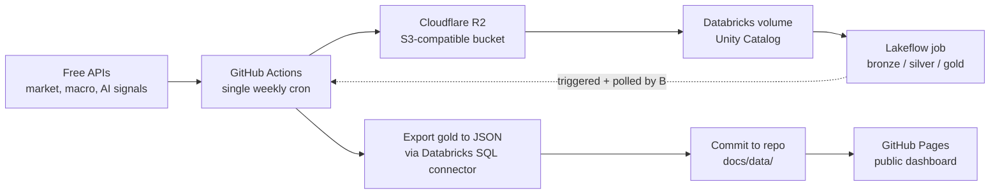

# Market & AI Pulse — Project Plan

A cron-scheduled, S3-backed, Databricks-powered ETL pipeline that publishes a free, publicly viewable dashboard tracking market performance, macro conditions, and AI-sector momentum.

**Status: all manual account setup is complete.** Every credential exists, every service is provisioned, the Unity Catalog volume is created. What's left is entirely buildable in Claude Code — see Section 7 for exactly what's done, and Section 9 for the build plan.

**How to use this doc:** hand Claude Code **one numbered step at a time** (e.g. "let's do step 1.3"), not a whole phase at once — the steps are deliberately broken into small, independently verifiable pieces so each one has a clear "did this work, yes or no" before moving to the next. Check items off as they're completed so the file stays an accurate log of where the build actually is.

---

## 1. What this project is

A weekly "Market & AI Pulse" briefing that answers a handful of concrete business questions rather than just charting prices:

- How did major indices and sectors move, and who's driving it?
- Is volatility rising or calm right now?
- What's the macro backdrop (inflation, employment, rates) doing?
- Is AI, specifically, outperforming or lagging the broader market?
- Is public attention on AI rising, and is the open-source/research ecosystem still accelerating?

Crypto was evaluated and deliberately cut — CoinGecko moved to a paywalled/limited free tier not worth building around for a secondary signal. Scope is market + macro + AI.

---

## 2. Architecture



### Orchestration & scheduling — how "automatic" actually works

Everything is driven by **one GitHub Actions workflow on one weekly cron trigger**, not several independent schedules. The single workflow run does all of this in sequence, and isn't considered successful until every step passes:

1. **Ingest** — pull all data sources, land raw files in the R2 bucket
2. **Stage** — push the same files into the Databricks Unity Catalog volume
3. **Trigger transform** — call the Databricks Jobs API (`run-now`) to kick off the Lakeflow job, then **poll** the run status until it finishes
4. **Export** — once the Lakeflow run succeeds, query the finished gold Delta tables directly from GitHub Actions using the Databricks SQL connector, write to JSON
5. **Publish** — commit that JSON into `docs/data/` and push; GitHub Pages rebuilds automatically on push

The Lakeflow job's own native cron trigger stays **disabled** — it only ever runs when called by step 3, which avoids two independent schedules drifting out of sync.

Because Databricks Free Edition's serverless compute restricts outbound internet to a trusted-domain allowlist, all outward-facing work (calling free APIs, writing to R2, pushing to GitHub) happens from GitHub Actions, not from inside Databricks. Databricks only ever does the transform.

---

## 3. Established configuration values (non-secret)

These are already set up and fixed — Claude Code should use these exact values, not placeholders:

| Value | Setting |
|---|---|
| Databricks catalog | `workspace` |
| Databricks schema (volume location only) | `default` |
| Unity Catalog volume name | `raw_landing` |
| **Unity Catalog volume path** | `/Volumes/workspace/default/raw_landing/` |
| Bronze/silver/gold schemas | `workspace.bronze`, `workspace.silver`, `workspace.gold` — created via SQL (`CREATE SCHEMA IF NOT EXISTS`) as part of the build, not manually provisioned |
| SQL warehouse | "Serverless Starter Warehouse" — already provisioned in the workspace; resolved dynamically via the Databricks SDK (`WorkspaceClient.warehouses.list()`) rather than hardcoding its ID/http_path |

This path is what the raw-file-landing step and the Lakeflow bronze read task both reference. It's not sensitive, so it lives here in plain text rather than in GitHub secrets.

---

## 4. Data sources

| Source | Provides | Auth | Notes |
|---|---|---|---|
| `yfinance` | Benchmark (`^GSPC`), 11 SPDR sector ETFs (XLK, XLF, XLE, XLV, XLY, XLP, XLI, XLB, XLRE, XLU, XLC), AI basket (NVDA, MSFT, GOOGL, META, PLTR, AMD, BOTZ) | None | Unofficial but widely used |
| FRED (St. Louis Fed) | CPI, unemployment, fed funds rate, 10Y yield | Free API key (in secrets) | Macro data doesn't move week to week anyway |
| Wikipedia Pageviews API | Attention signal — pageviews on "Artificial intelligence," "ChatGPT," "Large language model" | None | Official, stable. **Do not use pytrends** — archived April 2025, unreliable |
| GitHub REST/Search API | Star growth on curated AI/ML repos | None needed yet (unauthenticated rate limit is enough at weekly cadence) | Add `GH_TOKEN` later only if rate-limited |
| arXiv API | New paper counts, cs.AI / cs.LG | None | Simple XML response |

All sources are pulled together in the same weekly run.

---

## 5. Tech stack

- **Ingestion & orchestration:** GitHub Actions (single `schedule:` cron, weekly)
- **Object storage:** Cloudflare R2 (S3 API-compatible, free forever — 10GB storage, zero egress)
- **Lakehouse:** Databricks Free Edition — Unity Catalog volume, Lakeflow job (API-triggered, not self-scheduled), Delta Lake
- **Publishing:** Databricks SQL connector query + JSON export, run from the same GitHub Actions workflow
- **Dashboard front end:** static HTML/JS, Chart.js or Plotly.js reading a JSON file, served by GitHub Pages

---

## 6. Data model (medallion architecture)

- **Bronze** — raw landed files, one per source per run, untouched
- **Silver** — typed, deduplicated, joined across sources onto a common date key
- **Gold** — the tables that feed the dashboard:
  - `market_daily` — index/stock returns
  - `sector_rotation` — trailing performance by sector
  - `volatility` — rolling realized volatility
  - `macro_snapshot` — latest macro indicators + trend direction
  - `ai_vs_market` — AI basket return spread vs S&P 500
  - `attention_index` — normalized Wikipedia pageview trend
  - `dev_momentum` — weekly star growth across tracked repos
  - `research_pace` — weekly arXiv submission counts

---

## 7. Setup status — everything below is DONE

- [x] GitHub repo created, GitHub Pages enabled (serving from `/docs`)
- [x] Cloudflare account, R2 bucket created
- [x] R2 Account API token generated (Object Read & Write, scoped to the one bucket)
- [x] Databricks Free Edition account + workspace provisioned
- [x] Unity Catalog volume created → `/Volumes/workspace/default/raw_landing/`
- [x] Databricks personal access token generated (Other APIs scope)
- [x] FRED API key requested
- [x] All secrets added as GitHub Actions **repository** secrets (confirmed *not* environment secrets, so no approval-gate risk to the automation):
  - [x] `R2_ACCESS_KEY`
  - [x] `R2_SECRET_KEY`
  - [x] `R2_ENDPOINT`
  - [x] `R2_BUCKET`
  - [x] `DATABRICKS_HOST`
  - [x] `DATABRICKS_TOKEN`
  - [x] `FRED_API_KEY`
- [ ] `GH_TOKEN` — intentionally deferred, add only if the GitHub API rate limit becomes a problem
- [x] `gh` CLI installed locally and authenticated (`gh auth login`) — lets Claude Code dispatch and poll GitHub Actions runs directly for the rest of the build

Nothing left to do outside Claude Code. Everything from here is code.

---

## 8. Proposed repo structure

```
market-ai-pulse/
├── .github/workflows/
│   └── pipeline.yml          # single weekly cron: ingest -> trigger transform -> export -> publish
├── scripts/                  # reusable local/CI debugging scripts (not part of the pipeline)
│   ├── test_databricks_connection.py
│   └── test_r2_connection.py
├── requirements.txt
├── .env.example               # local-only credential template (.env is gitignored)
├── ingestion/
│   ├── run_ingestion.py           # single entrypoint pipeline.yml calls; wraps every source below
│   ├── pull_market_data.py
│   ├── pull_macro_data.py
│   ├── pull_attention_data.py
│   ├── pull_dev_momentum.py
│   ├── pull_research_pace.py
│   ├── land_to_r2.py
│   └── land_to_databricks_volume.py
├── databricks/
│   ├── warehouse.py               # resolves the SQL warehouse dynamically (no hardcoded ID)
│   ├── land_volume_to_bronze.py   # Lakeflow task: raw volume files -> bronze (PySpark, runs via git_source)
│   ├── bronze_to_silver.py        # Lakeflow task: typed, deduped, historized via MERGE
│   ├── silver_to_gold.py          # Lakeflow task: all 8 gold tables, fully recomputed each run
│   ├── query_bronze_market_data.py  # ad hoc debugging queries (via warehouse.py, not part of the job)
│   ├── query_silver_tables.py
│   ├── query_gold_tables.py
│   └── lakeflow_job_config.yml   # job definition (name, git_source, tasks) — no schedule field, ever
├── orchestration/
│   ├── trigger_and_poll_job.py   # calls Databricks run-now, waits for completion
│   └── export_gold_to_json.py    # queries gold tables via Databricks SQL connector
├── docs/                     # GitHub Pages site root
│   ├── index.html
│   ├── dashboard.js
│   ├── styles.css
│   └── data/                 # published JSON lands here
├── README.md
└── PROJECT_PLAN.md           # this file
```

---

## 9. Build plan — one step at a time

### Phase 0 — Scaffolding & connectivity proof

- [x] **0.1** Create the repo folder structure shown in Section 8 (empty placeholder files are fine for now)
- [x] **0.2** Initialize git locally, commit, push to the GitHub remote
- [x] **0.3** Confirm GitHub Pages is set to serve from `/docs` on the main branch — confirmed live at https://pdglenchur-glitch.github.io/market_ai_pulse/ (200 OK, serving placeholder index.html)
- [x] **0.4** Write a throwaway workflow (`.github/workflows/test_secrets.yml`) that only prints `true`/`false` for whether each secret is present — never the value — triggered manually (`workflow_dispatch`)
- [x] **0.5** Run that workflow manually, confirm all seven secrets show `true` — run [29899974190](https://github.com/pdglenchur-glitch/market_ai_pulse/actions/runs/29899974190), all 7 secrets `true`
- [x] **0.6** Write a small local test script that authenticates to Databricks with `DATABRICKS_HOST` + `DATABRICKS_TOKEN` and lists catalogs; confirm `workspace` appears — `scripts/test_databricks_connection.py`, run via Actions (R2 access/Databricks token are one-time-reveal secrets, not retrievable locally after creation), confirmed `workspace` in `['system', 'samples', 'workspace']`
- [x] **0.7** Extend that script (or write a second one) to confirm it can see the `raw_landing` volume at `/Volumes/workspace/default/raw_landing/` — confirmed reachable (empty, as expected)
- [x] **0.8** Write a small local test script that authenticates to R2 with the four `R2_*` secrets via `boto3` and lists bucket contents (should return empty) — `scripts/test_r2_connection.py`, confirmed 0 objects
- [x] **0.9** Delete or archive the throwaway secret-check workflow once 0.5–0.8 all pass — `test_secrets.yml` removed; `scripts/test_*_connection.py` kept as reusable local/CI debugging tools

### Phase 1 — Thin vertical slice (one source, fully end to end)

- [x] **1.1** Write `pull_market_data.py` to fetch one day of S&P 500 data via `yfinance`, save locally as JSON — fetches latest daily bar for `^GSPC`
- [x] **1.2** Run it locally, inspect the JSON structure — ran locally, clean OHLCV + symbol/date/fetched_at structure confirmed
- [x] **1.3** Write `land_to_r2.py` to upload that JSON to the R2 bucket under a `raw/` prefix
- [x] **1.4** Run it, confirm the object appears in the R2 bucket (Cloudflare dashboard or a list call) — confirmed via list call, `raw/market_data.json` present
- [x] **1.5** Write the Databricks Files API call that pushes the same JSON into `/Volumes/workspace/default/raw_landing/` — `ingestion/land_to_databricks_volume.py`
- [x] **1.6** Confirm the file appears there (Catalog Explorer or a notebook `%fs ls`) — confirmed via `WorkspaceClient.files.list_directory_contents`
- [x] **1.7** In a Databricks notebook, read that file and create one bronze Delta table (e.g. `bronze.market_data`) — done via SQL warehouse instead of a notebook (`databricks/land_volume_to_bronze.py`, resolves the warehouse dynamically via `databricks/warehouse.py`); created `workspace.bronze.market_data`. Note: JSON file is pretty-printed multi-line, so `read_files(...)` needs `multiLine => true`
- [x] **1.8** Query that table from Databricks SQL to confirm the full chain — API to R2 to volume to Delta table — actually works — confirmed via `databricks/query_bronze_market_data.py`, all 8 columns correct, `_rescued_data` is `None` (clean parse)

### Phase 2 — Automate ingestion for all sources

- [x] **2.1** Wrap the Phase 1 scripts into a single ingestion entrypoint — `ingestion/run_ingestion.py`, iterates a `SOURCES` list, lands each result in R2 + volume
- [x] **2.2** Write `pipeline.yml` with a weekly `schedule:` cron and a `workflow_dispatch` trigger, running just the market data step — Mondays 06:00 UTC + manual dispatch
- [x] **2.3** Manually dispatch it, confirm it succeeds unattended — run [29936971804](https://github.com/pdglenchur-glitch/market_ai_pulse/actions/runs/29936971804)
- [x] **2.4** Add `pull_macro_data.py` (FRED), wire it into the same workflow — CPI, unemployment rate, fed funds rate, 10Y yield
- [x] **2.5** Add `pull_attention_data.py` (Wikipedia Pageviews), wire it in — Artificial_intelligence, ChatGPT, Large_language_model articles
- [x] **2.6** Add `pull_dev_momentum.py` (GitHub API), wire it in — star snapshots on 5 curated repos (openai-python, transformers, pytorch, langchain, ollama)
- [x] **2.7** Add `pull_research_pace.py` (arXiv), wire it in — weekly submission counts for cs.AI, cs.LG via `opensearch:totalResults` (not by paging every entry)
- [x] **2.8** Manually dispatch the full workflow, confirm every source lands correctly in both R2 and the Databricks volume — run [29937382852](https://github.com/pdglenchur-glitch/market_ai_pulse/actions/runs/29937382852), independently verified via list calls: all 5 files present in both R2 and the volume

### Phase 3 — Transform (medallion layers), API-triggered

- [x] **3.1** Build `bronze_to_silver.py` for the market source only — typing, dedup — validate output — MERGE upsert keyed by `(symbol, date)`, explodes the multi-symbol `records` array
- [x] **3.2** Extend it for the macro source — melted to `(series, date, value)`, keyed by `(series, date)`
- [x] **3.3** Extend it for the attention source — melted to `(article, date, views)`, keyed by `(article, date)`
- [x] **3.4** Extend it for the dev-momentum source — melted to `(repo, snapshot_date, stars)`, keyed by `(repo, snapshot_date)`
- [x] **3.5** Extend it for the research-pace source — melted to `(category, snapshot_date, count)`, keyed by `(category, snapshot_date)`
- [x] **3.6** Build the `market_daily` gold table — per-symbol daily change/return via `LAG`
- [x] **3.7** Build the `sector_rotation` gold table — per-sector-ETF daily + trailing 5-day return
- [x] **3.8** Build the `volatility` gold table — rolling 20-observation stddev of S&P 500 daily returns
- [x] **3.9** Build the `macro_snapshot` gold table — latest value per series + up/down/flat trend
- [x] **3.10** Build the `ai_vs_market` gold table — AI-basket average return minus benchmark return
- [x] **3.11** Build the `attention_index` gold table — views indexed to each article's first-observed day = 100
- [x] **3.12** Build the `dev_momentum` gold table — week-over-week star growth per repo
- [x] **3.13** Build the `research_pace` gold table — week-over-week change in arXiv counts per category
- [x] **3.14** Package bronze → silver → gold as a single Lakeflow job with no native schedule attached — declared in `databricks/lakeflow_job_config.yml` (name, `git_source` pointing at this repo, 3 tasks); tasks run as `spark_python_task`s pulling code via `git_source` on serverless compute (`environment_version: "3"`), not via notebooks
- [x] **3.15** Write `trigger_and_poll_job.py`: calls `run-now` via the Databricks Jobs API, polls until the run finishes, fails loudly if the job fails — also creates-or-updates the job by name from the YAML config on every run, so the job definition never drifts from git
- [x] **3.16** Add that script as a step in `pipeline.yml`, after ingestion
- [x] **3.17** Manually dispatch the full workflow, confirm it triggers the Lakeflow job and correctly waits for it to finish — run [29940256903](https://github.com/pdglenchur-glitch/market_ai_pulse/actions/runs/29940256903) created the job; run [29940472736](https://github.com/pdglenchur-glitch/market_ai_pulse/actions/runs/29940472736) confirmed the idempotent update path (same `job_id` reused, not recreated)
- [x] **3.18** Spot-check each gold table with a manual query — `databricks/query_gold_tables.py`; all 8 tables populated with expected row counts (trend/change columns are `NULL` until a second distinct calendar week of history accumulates — expected, not a bug)

### Phase 4 — Publish

- [ ] **4.1** Write `export_gold_to_json.py`: connect via the Databricks SQL connector, query `market_daily`, write `docs/data/market_daily.json`
- [ ] **4.2** Extend it for `sector_rotation.json`
- [ ] **4.3** Extend it for `volatility.json`
- [ ] **4.4** Extend it for `macro_snapshot.json`
- [ ] **4.5** Extend it for `ai_vs_market.json`
- [ ] **4.6** Extend it for `attention_index.json`
- [ ] **4.7** Extend it for `dev_momentum.json`
- [ ] **4.8** Extend it for `research_pace.json`
- [ ] **4.9** Add the export step to `pipeline.yml`, running only after the Lakeflow job succeeds
- [ ] **4.10** Add a commit-and-push step using the default `GITHUB_TOKEN` (with `contents: write` permission set on the job)
- [ ] **4.11** Confirm GitHub Pages rebuilds automatically after that push

### Phase 5 — Dashboard

- [ ] **5.1** Build `docs/index.html` and `docs/styles.css` as a basic empty-panel layout
- [ ] **5.2** Build the market snapshot panel, reading `market_daily.json`
- [ ] **5.3** Build the sector rotation panel
- [ ] **5.4** Build the volatility panel
- [ ] **5.5** Build the macro backdrop panel
- [ ] **5.6** Build the AI pulse panel (combining `ai_vs_market`, `attention_index`, `dev_momentum`, `research_pace`)
- [ ] **5.7** Mobile-responsive pass
- [ ] **5.8** Open the public GitHub Pages link in a browser you're not logged into anything on — confirm it loads with zero login

### Phase 6 — Prove the automation, then polish

- [ ] **6.1** Manually trigger the full `pipeline.yml` once and confirm every step passes with no manual intervention
- [ ] **6.2** Let one real scheduled weekly run fire on its own; confirm the dashboard updates without you touching anything
- [ ] **6.3** Write `README.md` with the architecture diagram, screenshots, and the live link
- [ ] **6.4** Write a short design-decisions section (R2 vs AWS S3, Free Edition constraints, why the dashboard is static, why one workflow orchestrates everything, why crypto was cut) — this is the paragraph you'll actually use in interviews
- [ ] **6.5** Add failure alerting to the workflow (a step that notifies on failure, since a silent weekly failure means a stale dashboard with no obvious sign)

---

## 10. Known constraints, already designed around

- Databricks Free Edition won't mount a custom S3 bucket → R2 used as a separate, S3-compatible landing zone
- Databricks Free Edition serverless compute has a restricted outbound domain allowlist → all external API calls happen in GitHub Actions, never inside Databricks
- Databricks dashboards require a registered account to view, no public anonymous link → static export to GitHub Pages instead
- Two independently-scheduled cron systems can drift out of sync → the Lakeflow job has no schedule of its own; it's only ever triggered and awaited by the GitHub Actions run
- pytrends is archived/unreliable → Wikipedia Pageviews API used instead
- CoinGecko moved to a paid/limited tier not worth building around → crypto dropped entirely

## 11. Open questions to settle during the build

- [ ] Whether the AI basket lives in its own gold table or merges into `market_daily` with a flag column
- [ ] How much historical depth to retain for trend charts (e.g. 1 year rolling window)
- [ ] Whether/when to split some sources onto a faster (e.g. daily) cadence once weekly is stable
