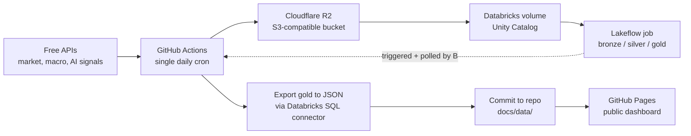

# Market & AI Pulse

A cron-scheduled, S3-backed, Databricks-powered ETL pipeline that publishes a free, publicly viewable dashboard tracking market performance, macro conditions, and AI-sector momentum.

**Live dashboard:** https://pdglenchur-glitch.github.io/market_ai_pulse/

## What it answers

- How did major indices and sectors move, and who's driving it?
- Is volatility rising or calm right now?
- What's the macro backdrop (inflation, employment, rates) doing?
- Is AI, specifically, outperforming or lagging the broader market?
- Is public attention on AI rising, and is the open-source/research ecosystem still accelerating?

## How it works

One GitHub Actions workflow, on one daily cron trigger, does the entire pipeline in sequence:

1. **Ingest** — pull market data (yfinance), macro indicators (FRED), public attention (Wikipedia Pageviews), dev momentum (GitHub), and research pace (arXiv); land raw files in R2
2. **Stage** — push the same files into a Databricks Unity Catalog volume
3. **Transform** — trigger a real Databricks Job (bronze → silver → gold, running as PySpark tasks on serverless compute, code pulled live from this repo) via the Jobs API, and wait for it to finish
4. **Export** — query the finished gold tables and write JSON
5. **Publish** — commit the JSON into `docs/`, which GitHub Pages serves automatically

No manual steps once triggered, no compute running outside of when the pipeline actually needs it.

## Docs

- [`PROJECT_PLAN.md`](PROJECT_PLAN.md) — full architecture, established config, and a step-by-step build log (what's done, what's left)
- [`PROJECT_MEMORY.md`](PROJECT_MEMORY.md) — narrative history: design decisions and why, bugs hit and how they were fixed
