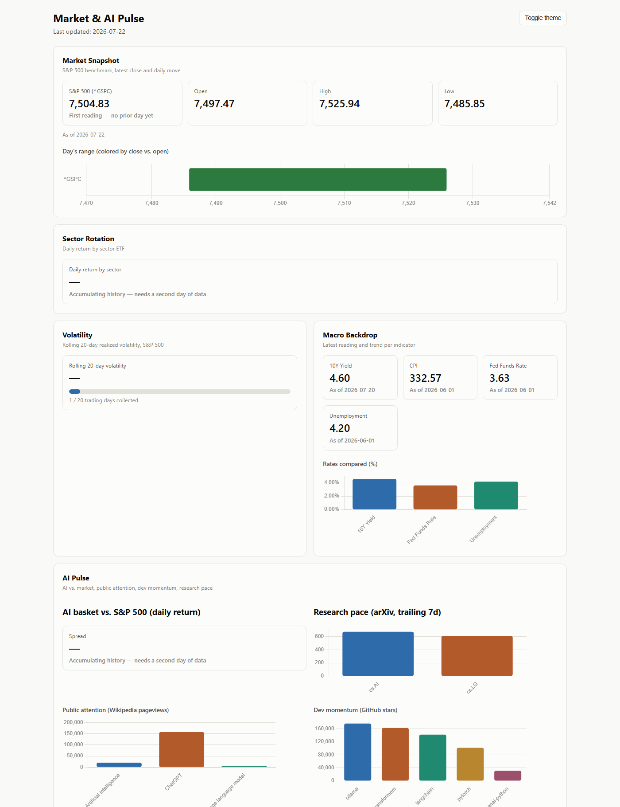
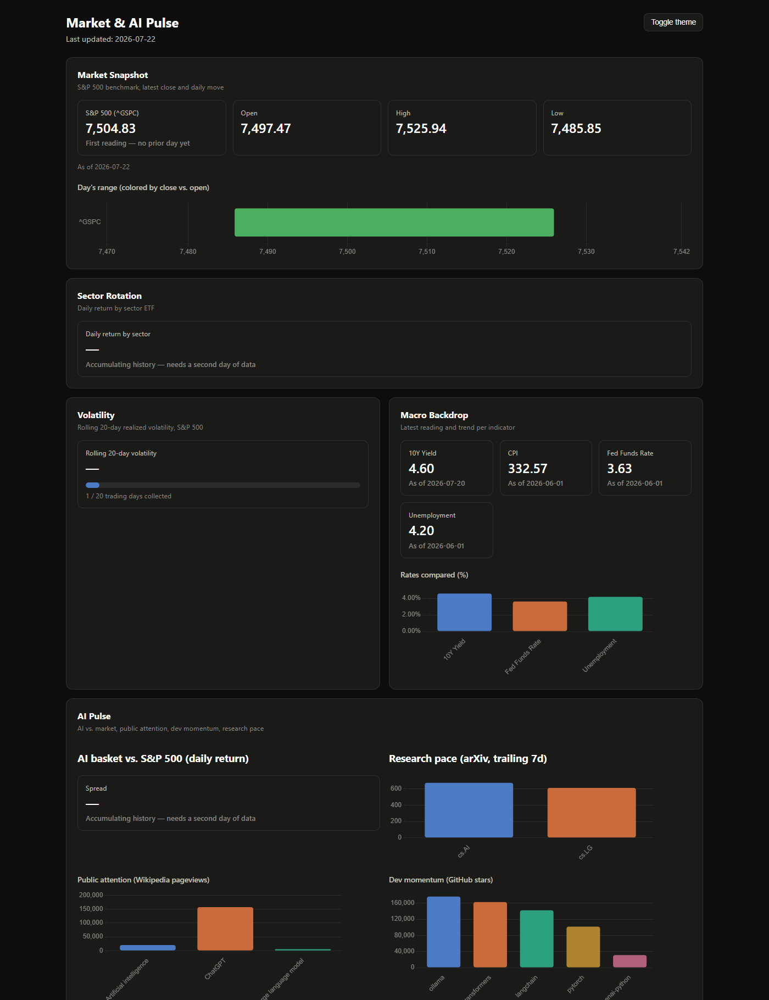
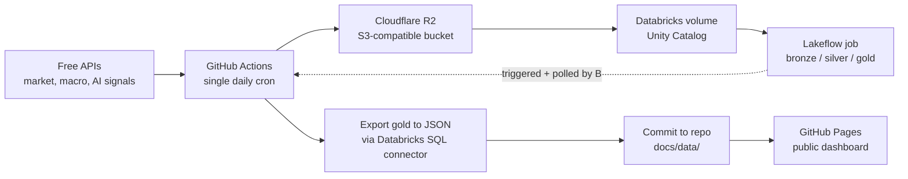

# Market & AI Pulse

A cron-scheduled, S3-backed, Databricks-powered ETL pipeline that publishes a free, publicly viewable dashboard tracking market performance, macro conditions, and AI-sector momentum.

**Live dashboard:** https://pdglenchur-glitch.github.io/market_ai_pulse/

Dark mode

Several panels above still show "Accumulating history" — that's expected, not broken. Some metrics (rolling volatility, week-over-week deltas) are mathematically undefined until enough daily runs have accumulated; see [PROJECT_MEMORY.md](PROJECT_MEMORY.md) for exactly how long each one takes.

## What it answers

- How did major indices and sectors move, and who's driving it?
- Is volatility rising or calm right now?
- What's the macro backdrop (inflation, employment, rates) doing?
- Is AI, specifically, outperforming or lagging the broader market?
- Is public attention on AI rising, and is the open-source/research ecosystem still accelerating?

## Reading the dashboard

### Market Snapshot

The S&P 500 is a stock index made up of 500 of the largest U.S. companies — it's the standard shorthand for "how is the stock market doing." **Open/High/Low/Close** are the price at the start of the trading day, the highest and lowest it touched, and where it ended; the number under the main figure shows how much it moved versus the prior day (green = up, red = down).

**Day's range** is a single bar spanning the day's low to its high — a wide bar means a volatile day, a narrow one means a quiet day. It's colored the same way (green if the index ended the day higher than it opened, red if lower), and as more days accumulate this turns into a strip of bars — effectively a simplified candlestick chart.

### Sector Rotation

A sector ETF is a basket of stocks from one slice of the economy — e.g. `XLK` holds tech companies, `XLE` holds energy companies. This chart shows how much each sector moved that day, so you can see which parts of the economy are leading and which are lagging. "Rotation" refers to money flowing out of some sectors and into others over time.

### Volatility

A measure of how much the market has been swinging up and down lately, based on the last 20 trading days (about a month). Higher means a choppier, more nervous market; lower means a calmer one. "Realized" volatility means it's calculated from what actually happened, not a forecast.

### Macro Backdrop

- **CPI** (Consumer Price Index) — the standard measure of inflation: how much prices for everyday goods and services have changed. Rising CPI means things are getting more expensive.
- **Unemployment rate** — the percentage of people looking for work who don't have a job. Higher means a weaker job market.
- **Fed funds rate** — the base interest rate set by the Federal Reserve. It ripples through the whole economy: mortgages, credit cards, savings accounts, and business loans all move with it.
- **10Y yield** — the interest rate the U.S. government pays to borrow money for 10 years. Widely watched as a signal of where investors expect the economy and interest rates to head.
- **Rates compared** chart puts the fed funds rate, unemployment rate, and 10Y yield side by side since all three are already percentages. CPI is left out of this chart on purpose — it's an index level (currently in the low 300s), not a percentage, so plotting it next to the others would be comparing different units on the same scale.

### AI Pulse

- **AI basket vs. S&P 500** — the "AI basket" is a handful of stocks closely tied to the AI boom (Nvidia, Microsoft, Google, Meta, Palantir, AMD) plus an AI-themed ETF (`BOTZ`). This compares their average daily move against the S&P 500's — a positive spread means AI stocks are outperforming the broader market that day, negative means they're lagging it.
- **Research pace** — how many new AI research papers were posted to [arXiv](https://arxiv.org) (the site researchers use to share papers, often before formal peer-reviewed publication) in the trailing 7 days, split into two overlapping fields: `cs.AI` (artificial intelligence broadly) and `cs.LG` (machine learning specifically). More papers posted means the research field is moving faster. Once 2+ days have accumulated, this becomes a line chart of that count over time, since the interesting question is whether the pace is *rising or falling*, not what it happens to be on any single day.
- **Public attention** — Wikipedia pageviews on the "Artificial intelligence," "ChatGPT," and "Large language model" articles, as a rough stand-in for how much the general public is thinking about or searching for information on AI. Once enough days have accumulated, this switches from raw view counts to a trend line indexed to each article's first-observed day (so you can compare their *rate of change* even though ChatGPT gets vastly more raw traffic than the others).
- **Dev momentum** — GitHub star counts for a handful of widely-used AI/ML open-source projects (PyTorch, Hugging Face Transformers, LangChain, Ollama, the OpenAI Python client), as a proxy for developer interest and adoption. Raw star count barely moves day to day and is dominated by how big a project already is, so once a project has 7 days of history this switches to *weekly star growth* instead — how many new stars it gained in the last week, which is the actual momentum signal.

## How it works

One GitHub Actions workflow, on one daily cron trigger, does the entire pipeline in sequence:

1. **Ingest** — pull market data (yfinance), macro indicators (FRED), public attention (Wikipedia Pageviews), dev momentum (GitHub), and research pace (arXiv); land raw files in R2
2. **Stage** — push the same files into a Databricks Unity Catalog volume
3. **Transform** — trigger a real Databricks Job (bronze → silver → gold, running as PySpark tasks on serverless compute, code pulled live from this repo) via the Jobs API, and wait for it to finish
4. **Export** — query the finished gold tables and write JSON
5. **Publish** — commit the JSON into `docs/`, which GitHub Pages serves automatically

No manual steps once triggered, no compute running outside of when the pipeline actually needs it.

## Design decisions

**Cloudflare R2 instead of AWS S3.** Databricks Free Edition can't mount a customer-owned S3 bucket, so *some* separate landing zone was required regardless of provider. R2 won on cost and simplicity for a project with no production SLA: free forever up to 10GB storage with zero egress fees, and an S3-compatible API means the same `boto3` code that would talk to S3 works unmodified — there's no R2-specific SDK to learn, and switching providers later is a config change, not a rewrite.

**Databricks Free Edition's constraints shaped the whole architecture, not just one corner of it.** Two limits in particular: serverless compute only reaches a trusted-domain allowlist (so it can't call yfinance, FRED, Wikipedia, GitHub, or arXiv directly), and there's no way to expose a Databricks-native dashboard publicly without a viewer account. Both are solved the same way — push everything that needs open internet or public visibility *out* of Databricks. GitHub Actions does all external API calls and all publishing; Databricks does only the transform, triggered and polled from outside.

**The dashboard is static HTML/JS reading a JSON file, not a live-querying app.** No dashboard-side database credentials to secure, nothing to keep warm, and it hosts for free on GitHub Pages. The tradeoff — data is only as fresh as the last pipeline run, not real-time — is the right one for a system whose backing data (daily market closes, monthly CPI) doesn't change faster than daily anyway.

**One GitHub Actions workflow orchestrates the entire pipeline, not five independent ones.** Ingestion, the Databricks transform trigger, export, and publish all live in a single job that runs top to bottom. The alternative — separate scheduled workflows per stage — creates a coordination problem for free: if ingestion and transform run on their own independent schedules, there's no guarantee ingestion finished before transform starts reading from it. One workflow with sequential steps sidesteps that entirely; the Databricks job itself also has no schedule of its own for the same reason, and only ever runs when this workflow calls it.

**Crypto was scoped out.** It was in the original plan as a secondary signal, but CoinGecko moved its useful endpoints behind a paid tier partway through evaluation. Not worth building a paid dependency into a portfolio project for data that was never more than supplementary — market, macro, and AI coverage stood fine without it.

## Docs

- [`PROJECT_PLAN.md`](PROJECT_PLAN.md) — full architecture, established config, and a step-by-step build log (what's done, what's left)
- [`PROJECT_MEMORY.md`](PROJECT_MEMORY.md) — narrative history: design decisions and why, bugs hit and how they were fixed
