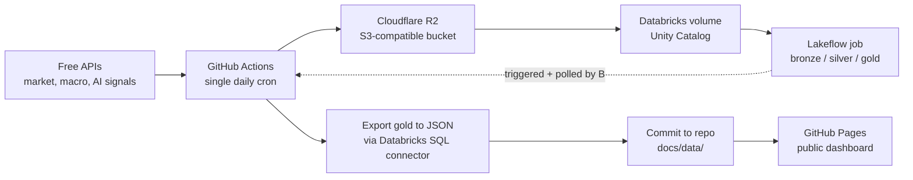

# Market & AI Pulse

A cron-scheduled, S3-backed, Databricks-powered ETL pipeline that publishes a free, publicly viewable dashboard tracking market performance, macro conditions, and AI-sector momentum.

**Live dashboard:** https://pdglenchur-glitch.github.io/market_ai_pulse/

Dark mode

Several panels above still show "Accumulating history" — that's expected, not broken. Some metrics (rolling volatility, week-over-week deltas) are mathematically undefined until enough daily runs have accumulated; see [PROJECT_MEMORY.md](PROJECT_MEMORY.md) for exactly how long each one takes.

## What it answers

- How did major indices and sectors move, and who's driving it?
- Is volatility rising or calm right now?
- What's the macro backdrop (inflation, employment, rates) doing?
- Is AI, specifically, outperforming or lagging the broader market?
- Is public attention on AI rising, and is the open-source/research ecosystem still accelerating?

## How it works

One GitHub Actions workflow, on one daily cron trigger, does the entire pipeline in sequence:

1. **Ingest** — pull market data (yfinance), macro indicators (FRED), public attention (Wikipedia Pageviews), dev momentum (GitHub), and research pace (arXiv); land raw files in R2
2. **Stage** — push the same files into a Databricks Unity Catalog volume
3. **Transform** — trigger a real Databricks Job (bronze → silver → gold, running as PySpark tasks on serverless compute, code pulled live from this repo) via the Jobs API, and wait for it to finish
4. **Export** — query the finished gold tables and write JSON
5. **Publish** — commit the JSON into `docs/`, which GitHub Pages serves automatically

No manual steps once triggered, no compute running outside of when the pipeline actually needs it.

## Design decisions

**Cloudflare R2 instead of AWS S3.** Databricks Free Edition can't mount a customer-owned S3 bucket, so *some* separate landing zone was required regardless of provider. R2 won on cost and simplicity for a project with no production SLA: free forever up to 10GB storage with zero egress fees, and an S3-compatible API means the same `boto3` code that would talk to S3 works unmodified — there's no R2-specific SDK to learn, and switching providers later is a config change, not a rewrite.

**Databricks Free Edition's constraints shaped the whole architecture, not just one corner of it.** Two limits in particular: serverless compute only reaches a trusted-domain allowlist (so it can't call yfinance, FRED, Wikipedia, GitHub, or arXiv directly), and there's no way to expose a Databricks-native dashboard publicly without a viewer account. Both are solved the same way — push everything that needs open internet or public visibility *out* of Databricks. GitHub Actions does all external API calls and all publishing; Databricks does only the transform, triggered and polled from outside.

**The dashboard is static HTML/JS reading a JSON file, not a live-querying app.** No dashboard-side database credentials to secure, nothing to keep warm, and it hosts for free on GitHub Pages. The tradeoff — data is only as fresh as the last pipeline run, not real-time — is the right one for a system whose backing data (daily market closes, monthly CPI) doesn't change faster than daily anyway.

**One GitHub Actions workflow orchestrates the entire pipeline, not five independent ones.** Ingestion, the Databricks transform trigger, export, and publish all live in a single job that runs top to bottom. The alternative — separate scheduled workflows per stage — creates a coordination problem for free: if ingestion and transform run on their own independent schedules, there's no guarantee ingestion finished before transform starts reading from it. One workflow with sequential steps sidesteps that entirely; the Databricks job itself also has no schedule of its own for the same reason, and only ever runs when this workflow calls it.

**Crypto was scoped out.** It was in the original plan as a secondary signal, but CoinGecko moved its useful endpoints behind a paid tier partway through evaluation. Not worth building a paid dependency into a portfolio project for data that was never more than supplementary — market, macro, and AI coverage stood fine without it.

## Docs

- [`PROJECT_PLAN.md`](PROJECT_PLAN.md) — full architecture, established config, and a step-by-step build log (what's done, what's left)
- [`PROJECT_MEMORY.md`](PROJECT_MEMORY.md) — narrative history: design decisions and why, bugs hit and how they were fixed
