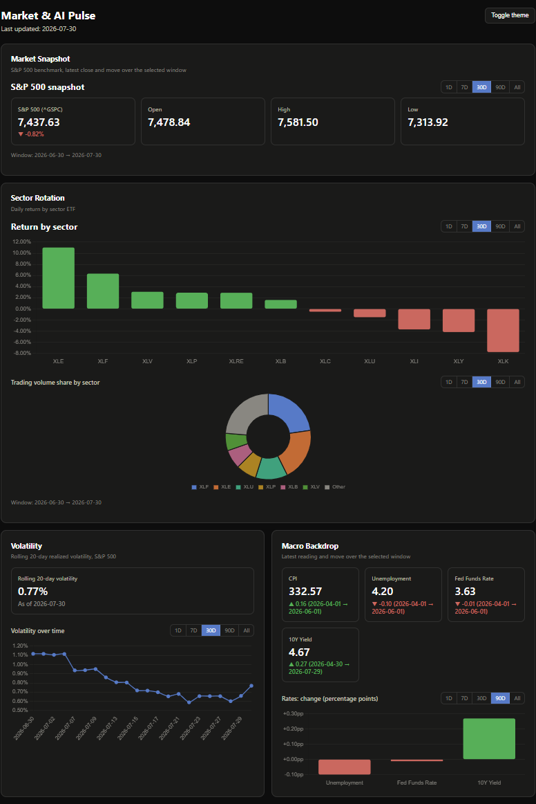
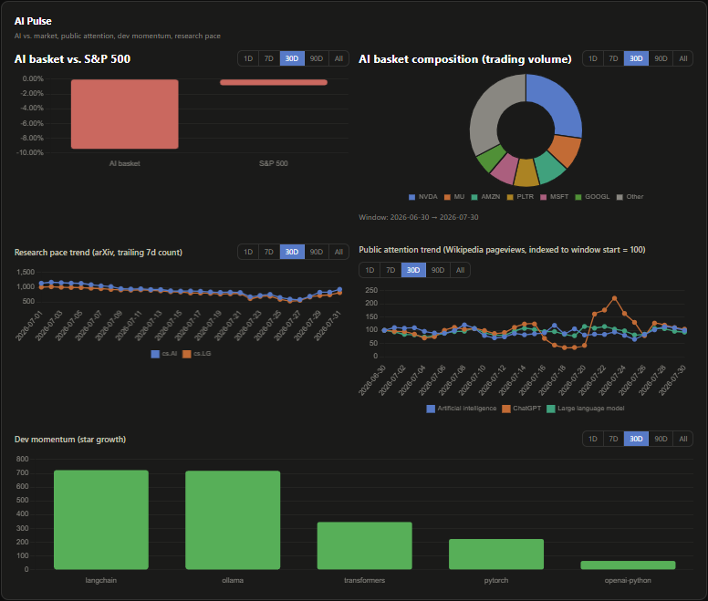
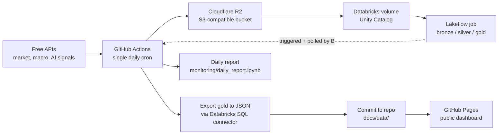

# Market & AI Pulse

An end-to-end data analytics pipeline that sources market, macroeconomic, and AI-sector data from five live APIs, models it through a SQL-based medallion (bronze/silver/gold) architecture, and publishes the results as a free, automatically refreshing public dashboard. It's a self-contained demonstration of the core data analyst workflow: sourcing and cleaning real-world data, transforming it with SQL, and turning it into visualizations a non-technical reader can actually understand, all running on a daily cron with zero manual intervention.

**Live dashboard:** https://pdglenchur-glitch.github.io/market_ai_pulse/

The charts above are backed by a full year of history, backfilled once from each source's own historical API and accumulating daily since.

Every panel has a **1D / 7D / 30D / 90D / All** selector in the top-right corner, and each one remembers its own selection independently, so you can look at 1 day of one metric and 90 of another at the same time. Hovering over any comparison bar (or a Market Snapshot tile) shows the exact two dates being compared, not just the selected window length.

## What it answers

- How did major indices and sectors move, and who's driving it?
- Is volatility rising or calm right now?
- What's the macro backdrop (inflation, employment, rates) doing?
- Is AI, specifically, outperforming or lagging the broader market?
- Is public attention on AI rising, and is the open-source/research ecosystem still accelerating?

## Key findings

Beyond the live dashboard, [`analysis/key_findings.ipynb`](analysis/key_findings.ipynb) is a monthly-refreshable notebook that pulls the same published data and digs into a few questions the dashboard itself doesn't answer directly. Three headline results from the current run:

- The AI basket has outperformed the S&P 500 by **47.9 points** over the trailing year (+65.8% vs. +17.9%). NVDA is still the single largest contributor to basket trading volume at **30%**, but across all 19 names the basket has moved from highly concentrated to unconcentrated by a standard Herfindahl measure.
- The 10 infrastructure names (foundry, chip equipment, memory, neocloud compute, datacenter power, real estate, networking, and server integration) added since the original basket returned **+102.8%** on average versus **+28.5%** for the original core names, but at nearly double the volatility, and 3 of the 10 are actually down over the same window, a reminder that the infrastructure theme working broadly didn't mean every stock in it won.
- Does AI-sector search attention lead or lag the stock moves? A full-year day-to-day correlation test says no, routine search interest shows no reliable relationship either way, but an event study on the handful of genuinely large attention spikes shows a real (if small-sample) gap worth tracking as more data accumulates.

Full methodology, all five findings, and the charts behind them are in the notebook, along with instructions for re-running it against whatever the pipeline has accumulated since.

## Reading the dashboard

### Market Snapshot

The S&P 500 is a stock index made up of 500 of the largest U.S. companies, and it's the standard shorthand for "how is the stock market doing." This panel is window-aware like the rest: **Close** is always the latest price, but **Open/High/Low** and the percent change below it are computed over whatever window you've selected. On 30D, for example, "Open" is the opening price 30 days ago and "High"/"Low" are the highest and lowest the index touched at any point in that window (green = up, red = down). Defaults to **30D** like every other panel; pick 1D for today vs. yesterday.

### Sector Rotation

A sector ETF is a basket of stocks from one slice of the economy: `XLK` holds tech companies, `XLE` holds energy companies. This chart shows each sector's return over the selected window, so you can see which parts of the economy are leading and which are lagging over whatever timeframe you're interested in. "Rotation" refers to money flowing out of some sectors and into others over time.

Below it, **Trading volume share by sector** is a different lens on the same 11 sectors: not which sectors moved, but which ones actually had the most trading activity over the selected window. The top 6 sectors are shown individually, with the rest folded into "Other" since a donut with 11 razor-thin slices stops being readable.

### Volatility

A measure of how much the market has been swinging up and down lately, based on the last 20 trading days (about a month). Higher means a choppier, more nervous market; lower means a calmer one. "Realized" volatility means it's calculated from what actually happened rather than forecasted.

### Macro Backdrop

- **CPI** (Consumer Price Index): the standard measure of inflation, tracking how much prices for everyday goods and services have changed. Rising CPI means things are getting more expensive.
- **Unemployment rate**: the percentage of people looking for work who don't have a job. Higher means a weaker job market.
- **Fed funds rate**: the base interest rate set by the Federal Reserve. It ripples through the whole economy: mortgages, credit cards, savings accounts, and business loans all move with it.
- **10Y yield**: the interest rate the U.S. government pays to borrow money for 10 years. Widely watched as a signal of where investors expect the economy and interest rates to head.
- **Rates: change** chart shows how much each rate has moved, in percentage points, over the selected window (for example, "the 10Y yield is up 0.3pp over the last 30 days"). CPI is left out of this chart on purpose: it's an index level (currently in the low 300s) rather than a percentage, so plotting it next to the others would mean comparing different units on the same scale. The KPI tiles above it show each series' current level, but the change beneath it is window-aware too: it always compares to the start of whatever window is selected, same as the chart. CPI, unemployment, and Fed funds rate publish monthly, so a short window (1D, 7D, sometimes 30D) will often show "not enough history in this window" until a second reading for that period actually exists.

### AI Pulse

- **AI basket vs. S&P 500**: the "AI basket" spans the AI value chain rather than just a handful of mega-cap names, spanning chip design (Nvidia, AMD, Broadcom), the foundry and equipment behind them (TSMC, Applied Materials), AI memory (Micron), hyperscale cloud and neocloud compute (Microsoft, Google, Amazon, CoreWeave), AI research/social (Meta), enterprise AI software (Palantir), datacenter power and real estate (Vertiv, Digital Realty, Bloom Energy, Constellation Energy), networking (Arista Networks), AI server/systems integration (Super Micro Computer), and a thematic ETF (`BOTZ`) as a passive diversification check. This compares their combined return against the S&P 500's over the selected window. A positive spread means AI stocks are outperforming the broader market over that timeframe; a negative spread means they're lagging it. Below it, **AI basket composition** shows the same basket by trading volume share instead: which names are dominating activity within it over that window, not which one moved the most. The top 6 are shown individually, with the rest folded into "Other."
- **Research pace**: how many new AI research papers were posted to [arXiv](https://arxiv.org) (the site researchers use to share papers, often before formal peer-reviewed publication) in the trailing 7 days, split into two overlapping fields: `cs.AI` (artificial intelligence broadly) and `cs.LG` (machine learning specifically). More papers posted means the research field is moving faster. Shown as a line chart of that trailing count over time, filterable to the selected window, since the interesting question is whether the pace is *rising or falling* rather than what it happens to be on any single day.
- **Public attention**: Wikipedia pageviews on the "Artificial intelligence," "ChatGPT," and "Large language model" articles, as a rough stand-in for how much the general public is thinking about or searching for information on AI. Shown as a trend line indexed to 100 at the *start of the selected window*, so switching the window re-baselines the comparison and lets you see each article's rate of change within that specific timeframe even though ChatGPT gets vastly more raw traffic than the others.
- **Dev momentum**: GitHub star counts for a handful of widely-used AI/ML open-source projects (PyTorch, Hugging Face Transformers, LangChain, Ollama, the OpenAI Python client), as a proxy for developer interest and adoption. Raw star count barely moves day to day and is dominated by how big a project already is, so the chart shows *star growth over the selected window* instead: how many new stars a project gained in that timeframe, which is the actual momentum signal.

## How it works

One GitHub Actions workflow, on one daily cron trigger, does the entire pipeline in sequence:

```mermaid
flowchart LR
    A[Free APIs\nmarket, macro, AI signals] --> B[GitHub Actions\nsingle daily cron]
    B --> C[Cloudflare R2\nS3-compatible bucket]
    C --> D[Databricks volume\nUnity Catalog]
    D --> E[Lakeflow job\nbronze / silver / gold]
    E -.triggered + polled by B.-> B
    B --> F[Export gold to JSON\nvia Databricks SQL connector]
    F --> G[Commit to repo\ndocs/data/]
    G --> H[GitHub Pages\npublic dashboard]
    B --> I[Daily report\nmonitoring/daily_report.ipynb]
```

1. **Ingest**: pull market data (yfinance), macro indicators (FRED), public attention (Wikipedia Pageviews), dev momentum (GitHub), and research pace (arXiv); land raw files in R2
2. **Stage**: push the same files into a Databricks Unity Catalog volume
3. **Transform**: trigger a real Databricks Job (bronze → silver → gold, running as PySpark tasks on serverless compute, code pulled live from this repo) via the Jobs API, and wait for it to finish
4. **Export**: query the finished gold tables and write JSON
5. **Publish**: commit the JSON into `docs/`, which GitHub Pages serves automatically
6. **Report**: regenerate `monitoring/daily_report.ipynb` and commit it, confirming the run actually succeeded and every source landed data appropriate for the day — this step runs even if an earlier one failed, so a bad day still produces a report explaining what went wrong

No manual steps once triggered, no compute running outside of when the pipeline actually needs it.

## Design decisions

**Cloudflare R2 instead of AWS S3.** Databricks Free Edition can't mount a customer-owned S3 bucket, so *some* separate landing zone was required regardless of provider. R2 won on cost and simplicity for a project with no production SLA: free forever up to 10GB storage with zero egress fees, and an S3-compatible API means the same `boto3` code that would talk to S3 works unmodified. There's no R2-specific SDK to learn, and switching providers later is just a config change.

**Databricks Free Edition's constraints shaped the whole architecture.** Two limits in particular: serverless compute only reaches a trusted-domain allowlist, so it can't call yfinance, FRED, Wikipedia, GitHub, or arXiv directly, and there's no way to expose a Databricks-native dashboard publicly without a viewer account. Both are solved the same way: push everything that needs open internet or public visibility *out* of Databricks. GitHub Actions does all external API calls and all publishing; Databricks does only the transform, triggered and polled from outside.

**The dashboard is static HTML/JS reading a JSON file.** No dashboard-side database credentials to secure, nothing to keep warm, and it hosts for free on GitHub Pages. The tradeoff (data is only as fresh as the last pipeline run) is the right one for a system whose backing data (daily market closes, monthly CPI) doesn't change faster than daily anyway.

**One GitHub Actions workflow orchestrates the entire pipeline.** Ingestion, the Databricks transform trigger, export, and publish all live in a single job that runs top to bottom. Separate scheduled workflows per stage would create a coordination problem for free: if ingestion and transform run on their own independent schedules, there's no guarantee ingestion finished before transform starts reading from it. One workflow with sequential steps sidesteps that entirely; the Databricks job itself also has no schedule of its own for the same reason, and only ever runs when this workflow calls it.

**Crypto was scoped out.** It was in the original plan as a secondary signal, but CoinGecko moved its useful endpoints behind a paid tier partway through evaluation. Not worth building a paid dependency into a portfolio project for data that was never more than supplementary; market, macro, and AI coverage stood fine without it.

**The daily report queries Databricks directly rather than the published JSON.** `analysis/key_findings.ipynb` deliberately reads the public JSON so anyone can run it with zero credentials, but a pipeline health check built the same way could be fooled by a bug in the export step itself — the exact gap that let a full trading day quietly go missing from the dashboard for real (see `PROJECT_MEMORY.md` bug #19) while every run still reported success. `monitoring/daily_report.ipynb` checks the actual gold tables and the GitHub Actions run history independently, then gets regenerated and committed as the pipeline's own last step, overwriting the previous day's version rather than accumulating a file per day.

## Docs

- [`PROJECT_PLAN.md`](PROJECT_PLAN.md): full architecture, established config, and a step-by-step build log (what's done, what's left)
- [`PROJECT_MEMORY.md`](PROJECT_MEMORY.md): narrative history covering design decisions and why, and bugs hit and how they were fixed
- [`analysis/key_findings.ipynb`](analysis/key_findings.ipynb): the monthly analysis notebook behind the Key findings section above
- [`monitoring/daily_report.ipynb`](monitoring/daily_report.ipynb): the pipeline's own daily health check, regenerated fresh every run
